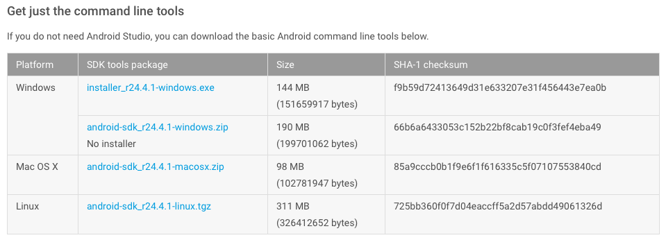
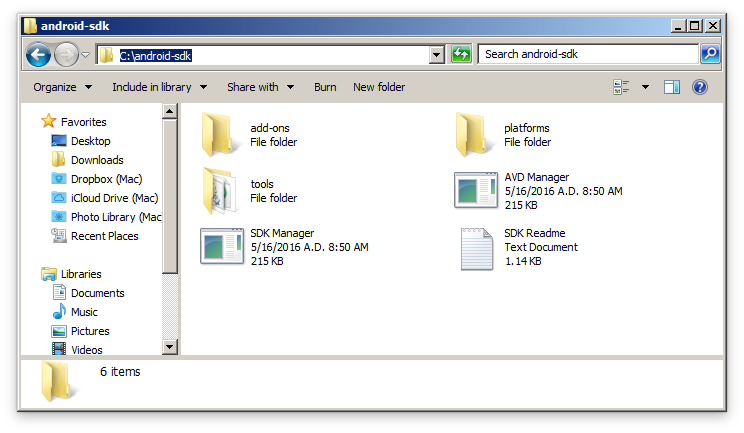
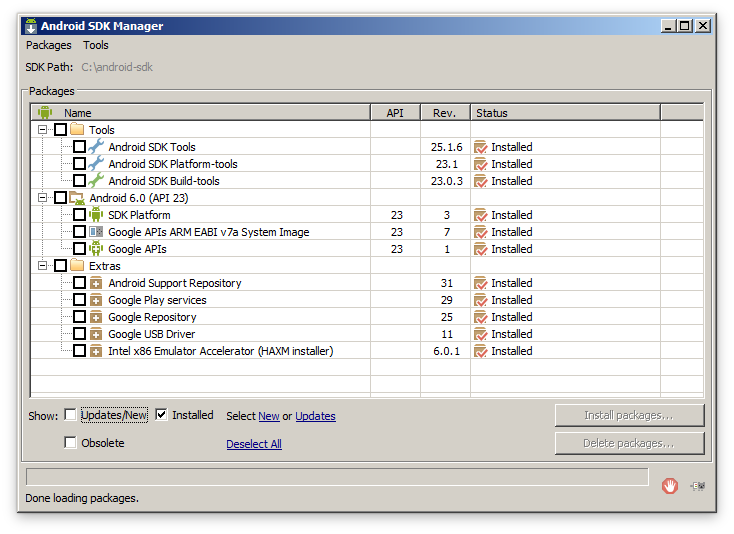
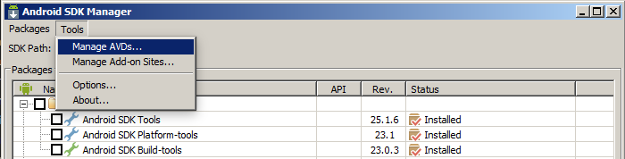
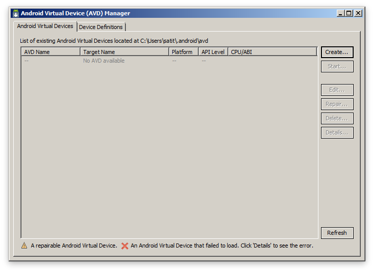
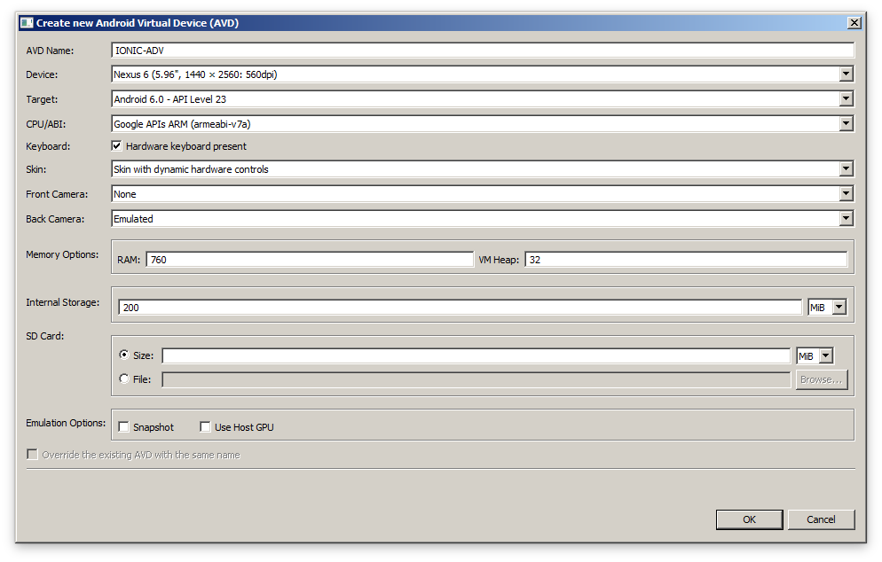

# การติดตั้งซอฟท์แวร์ที่จะเป็นในการใช้งาน

## Git
## ติดตั้ง Git
### บน Windows

โดยสามารถดาวน์โหลดได้จากเว็บไซต์​ [https://git-scm.com/downloads](https://git-scm.com/downloads)
เมื่อติดตั้งเสร็จให้ทดสอบการใช้งานโดยเปิด git-shell ขึ้นมาแล้วพิมพ์

```
$ git --version
git version 2.8.2

```

### บน OSX

สำหรับ OSX ให้ทำการติดตั้ง Xcode ก่อน ซึ่งในชุดติดตั้งจะมีการติดตั้ง git ให้ด้วย

## ติดตั้ง NodeJS

### บน Windows

ดาวน์โหลดได้จากเว็บไซต์ [https://nodejs.org/en/download](https://nodejs.org/en/download) โดยให้เลือกเวอร์ชั่นที่เป็น `LTS` ล่าสุดคือเวอร์ชั่น `v4.4.4`  และให้เลือกที่ `Windows Installer (.msi)`

### บน OSX

- Install homebrew
โดยรันคำสั่งต่อไปนี้ใน Terminal (Copy/Past ได้จากเว็บไซต์ [http://brew.sh](http://brew.sh))

```
/usr/bin/ruby -e "$(curl -fsSL https://raw.githubusercontent.com/Homebrew/install/master/install)"
```

จากนั้นรันคำสั่ง `brew doctor` และ `brew update` ตามลำดับ

- Installation
ติดตั้งโดยใช้คำสั่ง

```
$ brew install node4-lts
```

- Testing
ทดสอบการใช้งานโดยใช้คำสั่ง

```
$ node -v
$ npm -v
```

## ติดตั้ง Java

ดาวน์โหลด JDK ได้ที่เว็บไซต์ [http://www.oracle.com/technetwork/java/javase/downloads/index.html](http://www.oracle.com/technetwork/java/javase/downloads/index.html)

เมื่อดาวน์โหลดและทำการติดตั้งเสร็จแล้วให้ทดสอบการใช้งาน โดยการเปิด Terminal ขึ้นมาแล้วพิมพ์ ดังนี้

```
$ java -version
java version "1.8.0_91"
Java(TM) SE Runtime Environment (build 1.8.0_91-b14)
Java HotSpot(TM) 64-Bit Server VM (build 25.91-b14, mixed mode)
```

จะปรากฎผลลัพธ์ ดังตัวอย่าง แสดงว่าการติดตั้ง Java ได้เสร็จเรียบร้อยแล้ว

## ติดตั้ง Android SDK และสร้าง Emulator

- Download SDK
Download from: `http://developer.android.com/sdk/index.html`  โดยเลือกเฉพาะ SKD เวอร์ชันปัจจุบันคือ [android-sdk_r24.4.1-windows](http://dl.google.com/android/android-sdk_r24.4.1-windows.zip) (เลือกติดตั้งเฉพาะ SDK)

เมื่อดาวน์โหลดเสร็จให้ทำการแตก zip ไฟล์ออกแล้วเก็บไว้ที่ C:\ ดังรูป

- Configure PATH
- Install Android library and SDK tools
เมื่อได้ทำการกำหนด PATH เสร็จเรียบร้อยแล้วให้รันคำสั่ง `android` ใน Terminal เพื่อติดตั้ง SDK ดังนี้

```
$ android
```

จะปรากฎหน้าจอให้กำหนดค่า SDK ให้เลือกรายการสำหรับติดตั้ง ดังรูป




***Tools***
ให้เลือก `Android SDK Tools`, `Android SDK Platform-tools`, `Android SDK Build-tools`

***Android 6.0 (API 23)***
ให้เลือก `SDK Platform`, `Google APIs ARM EABI v7a System Image`, `Google APIs`

***Extras***
ให้เลือก `Android Support Repository`, `Google Play service`, `Google Repository`, `Google USB Driver`, `Intel x86 Emulator Accelerator (HAXM installer)`

- Create AVD (Android Virtual Device)

สร้าง AVD โดยไปเปิด SDK Manager ขึ้นมาแล้วไปที่เมนู `Tools-->Manage AVDs` หรือ รันคำส่ง `android avd` จะปรากฎหน้าจอ ดังรูป



จากนั้นให้คลิกปุ่ม `Create` เพื่อทำการสร้าง Device ดังรูป



จากนั้นให้กำหนดค่าการสร้าง ADV ดังรูป (สามารถปรับเปลี่ยนเพิ่ม RAM ได้ตามความเหมาะสม)




## ติดตั้ง Ionic

### วิธีการติดตั้ง

- บน Windows

```
$ npm install -g ionic cordova
```

- บน OSX

```
$ npm install -g ionic cordova ios-sim
```

### Basic Ionic App

ทดสอบสร้าง project ใหม่สำหรับ ionic โดยใช้คำสั่ง ดังนี้

```
$ ionic start myApp tabs
$ cd myApp
$ ionic platform add android
$ ionic build android
$ ionic emulate android
```

## ติดตั้ง package อื่นๆ ที่จำเป็นในการใช้งาน

```
$ npm install -g bower gulp http-server nodemon express
```