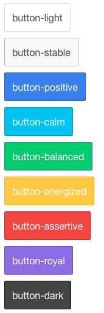

# Basic Ionic core components
## Create/Run/Debug project
### Create project
```
$ ionic start myApp blank|tabs|sidemenu
```
### Run project
```
$ ionic serve
```

### Emulate
```
$ ionic emulate android | ios
```

### Run on device

```
$ ionic run android | ios
```

## Colors


## Header and Footer


### Header

สามารถใช้ได้ทั้ง css (class) และ directive

#### CSS class

โดยใช้ class `.bar .bar-header`

```
<div class="bar bar-header bar-positive">

</div>
```

#### Directive

โดยใช้ directive `ion-header-bar`

```
<ion-header-bar align-title="left" class="bar-positive">

</ion-header-bar>
```

`align-title` สามารถกำหนดได้เป็น `left`, `right`, หรือ `center` ค่าปกติ คือ `center`

#### Header with button

```
<div class="bar bar-header bar-positive">
  <button class="button button-clear">Left</button>
  <div class="title">Welcome to My App</div>
  <button class="button button-clear">Right</button>
</div>
```

### Sub Header

```
<div class="bar bar-header">
  <h1 class="title">Header</h1>
</div>
<div class="bar bar-subheader">
  <h2 class="title">Sub Header</h2>
</div>
```

### Footer

สามารถใช้ได้ทั้ง css (class) และ directive

#### CSS class

```
<div class="bar bar-footer bar-balanced">
  <div class="title">Footer</div>
</div>
```

#### Directive

```
<ion-content class="has-footer">
  Some content!
</ion-content>

<ion-footer-bar align-title="left" class="bar-assertive">

</ion-footer-bar>
```

`align-title` สามารถกำหนดได้เป็น `left`, `right`, หรือ `center` ค่าปกติ คือ `center`

#### Footer with button

```
<div class="bar bar-footer">
  <button class="button button-clear">Left</button>
  <div class="title">Title</div>
  <button class="button button-clear">Right</button>
</div>
```

## Button

### Default button

ตัวอย่าง



```
<button class="button">
  Default
</button>

<button class="button button-stable">
  button-stable
</button>
```

### Block button

ตัวอย่าง


```
<button class="button button-block button-positive">
  Block Button
</button>
```

### Button Size

ตัวอย่าง


```
<button class="button button-small button-assertive">
  Small Button
</button>
<button class="button button-large button-positive">
  Large Button
</button>
```

### Outlined button

ตัวอย่าง


```
<button class="button button-outline button-positive">
  Outlined Button
</button>
```

## List


list เราสามารถใช้ได้ทั้ง css และ directive

### ใช้ CSS

```
<ul class="list">
    <li class="item">
      ...
    </li>
</ul>
```

### ใช้ Directive

```
<ion-list>
  <ion-item>
    ...
  </ion-item>
</ion-list>
```

### List with icon


```
<div class="list">

  <a class="item item-icon-left" href="#">
    <i class="icon ion-email"></i>
    Check mail
  </a>


  <a class="item item-icon-left" href="#">
    <i class="icon ion-mic-a"></i>
    Record album
    <span class="item-note">
      Grammy
    </span>
  </a>

  <a class="item item-icon-left" href="#">
    <i class="icon ion-person-stalker"></i>
    Friends
    <span class="badge badge-assertive">0</span>
  </a>

</div>
```

## Card


```
<div class="card">
  <div class="item item-text-wrap">
    This is a basic Card which contains an item that has wrapping text.
  </div>
</div>
```

### Card with Header and Footer


```
<div class="card">
  <div class="item item-divider">
    I'm a Header in a Card!
  </div>
  <div class="item item-text-wrap">
    This is a basic Card with some text.
  </div>
  <div class="item item-divider">
    I'm a Footer in a Card!
  </div>
</div>
```

## Form


```
<div class="list">
  <label class="item item-input">
    <input type="text" placeholder="First Name">
  </label>
  <label class="item item-input">
    <input type="text" placeholder="Last Name">
  </label>
  <label class="item item-input">
    <textarea placeholder="Comments"></textarea>
  </label>

  <button class="button button-block button-positive activated">Submit</button>
</div>
```
## Toggle


### Baisc Toggle

```
<label class="toggle">
   <input type="checkbox">
   <div class="track">
     <div class="handle"></div>
   </div>
</label>
```

### Toggle with list

```
<ul class="list">

  <li class="item item-toggle">
     HTML5
     <label class="toggle toggle-assertive">
       <input type="checkbox">
       <div class="track">
         <div class="handle"></div>
       </div>
     </label>
  </li>

  ...

</ul>
```

## Range


```
<div class="item range">
  <i class="icon ion-volume-low"></i>
  <input type="range" name="volume">
  <i class="icon ion-volume-high"></i>
</div>

<div class="list">
  <div class="item range range-positive">
    <i class="icon ion-ios-sunny-outline"></i>
    <input type="range" name="volume" min="0" max="100" value="33">
    <i class="icon ion-ios-sunny"></i>
  </div>
</div>
```
## Tabs


Tab เราสามารถใช้งานได้ทั้ง CSS และ Directive

### CSS

```
<div class="tabs">
  <a class="tab-item">
    Home
  </a>
  <a class="tab-item">
    Favorites
  </a>
  <a class="tab-item">
    Settings
  </a>
</div>
```

### Directive

```
<ion-tabs class="tabs-positive tabs-icon-top">

  <ion-tab title="Home" icon-on="ion-ios-filing" icon-off="ion-ios-filing-outline">
    ...
  </ion-tab>

  <ion-tab title="About" icon-on="ion-ios-clock" icon-off="ion-ios-clock-outline">
    ...
  </ion-tab>

  <ion-tab title="Settings" icon-on="ion-ios-gear" icon-off="ion-ios-gear-outline">
    ...
  </ion-tab>

</ion-tabs>

```

เราสามารถกำหนดค่าเพิ่มเติมให้กับ `ion-tab` ได้ ดังนี้

```
<ion-tab
  title="Tab!"
  icon="my-icon"
  href="#/tab/tab-link"
  on-select="onTabSelected()"
  on-deselect="onTabDeselected()">
</ion-tab>
```

`icon-on` icon ขณะแท็บถูกเลือก, `icon-off` icon ขณะแท็บไม่ได้ถูกเลือก

### Tab with icon only

```
<div class="tabs tabs-icon-only">
  <a class="tab-item">
    <i class="icon ion-home"></i>
  </a>
  <a class="tab-item">
    <i class="icon ion-star"></i>
  </a>
  <a class="tab-item">
    <i class="icon ion-gear-a"></i>
  </a>
</div>
```

### Tab with icon and text

```
<div class="tabs tabs-icon-top">
  <a class="tab-item">
    <i class="icon ion-home"></i>
    Home
  </a>
  <a class="tab-item">
    <i class="icon ion-star"></i>
    Favorites
  </a>
  <a class="tab-item">
    <i class="icon ion-gear-a"></i>
    Settings
  </a>
</div>
```

## Page navigation

## List and Form
## Modal and Action Sheet
## Tabs
## Emulate and Debugging

