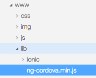

# Camera plugin
## Install plugin

### ติดตั้ง ngCordova

ดาวน์โหลด ngCordova จากเว็บไซต์ [https://github.com/driftyco/ng-cordova/archive/master.zip](https://github.com/driftyco/ng-cordova/archive/master.zip)
ทำการแตก zip ไฟล์ แล้ว copy ไฟล์ `ng-cordova.min.js` ในโฟลเดอร์ `dist` ไปไว้ใน โฟลเดอร์ `www/lib` ดังรูป



จากนั้นทำการแก้ไขไฟล์ `www/js/app.js` โดยทำการ Inject module ชื่อ `ngCordova` ดังนี้

```
angular.module('starter', ['ionic', 'ngCordova'])
```

### ติดตั้ง camera plugin

ทำการติดตั้ง plugin โดยใช้คำสั่ง ดังนี้ (ในโฟล์เดอร์ project)

```
$ ionic plugin add cordova-plugin-camera
```

## บันทึกภาพจากกล้อง

### Options

### Get Image from Camera

### Get Image from Photo library


## Upload image to server
